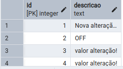
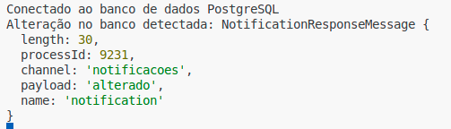

# Web-socket

## Instalação

Executar o arquivo "postgresql-notification.sql" na IDE do postgresql.

1. Cria a tabela "notificacoes".
2. Cria a função que notifica em real time a alteração na tabela "notificacoes".
3. O arquivo "socket-test.sql" quando executado, faz alteração na tabela "notificacoes", que dispara o aviso do evento.

### Para rodar

node src/server.js

### Ao alterar a tabela temos o log

UPDATE notificacoes SET descricao = 'OFF' WHERE id=2;

